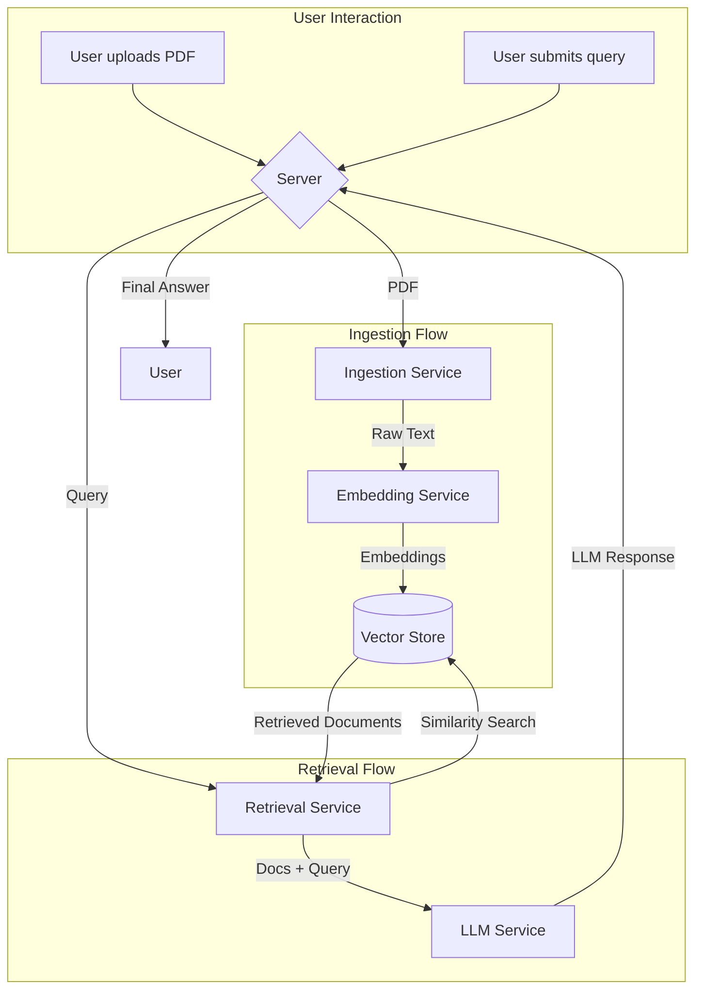

# Simple RAG AI

This project is a simple Retrieval-Augmented Generation (RAG) application that allows users to upload a PDF document, ask questions about it, and receive answers generated by a Large Language Model (LLM).

## Architecture

The application is built with a modular, service-oriented architecture. The frontend is created with Streamlit, and the backend is a FastAPI server.

The core components are:
- **UI (Streamlit)**: Provides the user interface for file upload and querying.
- **Server (FastAPI)**: Orchestrates the different services.
- **Ingestion Service**: Handles receiving documents, extracting text.
- **Embedding Service**: Converts text into vector embeddings.
- **Vector Store**: Stores the vector embeddings for similarity search. This implementation uses an in-memory vector store.
- **Retrieval Service**: Retrieves relevant document chunks from the vector store based on a user's query.
- **LLM Service**: Generates a response to the user's query based on the retrieved context.

Here is a diagram of the architecture flow:



## Getting Started

### Prerequisites

- Python 3.8+
- An environment variable manager (like `dotenv`)

### Setup

1.  **Clone the repository:**
    ```bash
    git clone <your-repository-url>
    cd simple-rag-ai-upskilling
    ```

2.  **Create and activate a virtual environment:**
    ```bash
    python -m venv venv
    source venv/bin/activate
    # On Windows, use: venv\Scripts\activate
    ```

3.  **Install the dependencies:**
    ```bash
    pip install -r server/requirements.txt
    ```

4.  **Set up environment variables:**

    Create a `.env` file in the root of the `server` directory:
    ```
    server/.env
    ```

    Add your Google API key to the `.env` file. This is required for both the embedding model and the LLM.
    ```
    GOOGLE_API_KEY="your-google-api-key"
    ```

### Running the Application

You need to run two processes in separate terminals: the FastAPI server and the Streamlit UI.

1.  **Run the FastAPI server:**
    From the root directory (`simple-rag-ai-upskilling`):
    ```bash
    uvicorn server.app:app --reload --port 8000
    ```

2.  **Run the Streamlit UI:**
    In a new terminal, from the root directory:
    ```bash
    streamlit run server/ui.py
    ```

    The UI will be accessible at `http://localhost:8501`.

## Usage

1.  Open your browser and navigate to `http://localhost:8501`.
2.  Use the file uploader to ingest a PDF document.
3.  Once the document is ingested, you can ask questions in the query box.
4.  Click "Retrieve" to get an answer based on the document's content.

